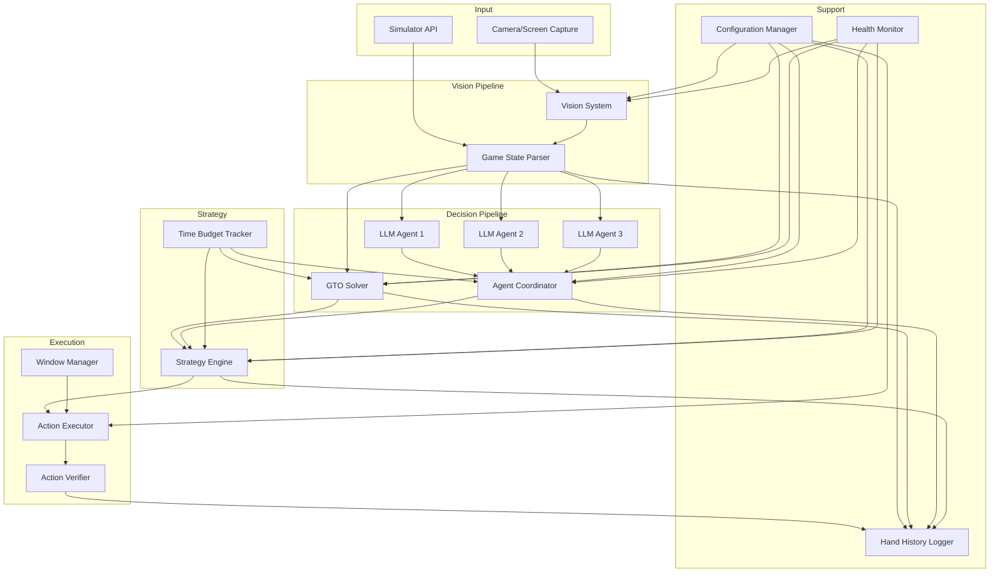

# AI Poker Bot Design Document

## Overview

The AI Poker Bot is a multi-component system that combines computer vision, game theory optimal (GTO) solving, and multi-agent LLM reasoning to make autonomous poker decisions. The system operates within strict compliance boundaries, supporting only simulator/API environments or explicitly permitted platforms.

The architecture follows a pipeline model: Vision → State Parsing → Parallel Decision Computation (GTO + LLM Agents) → Strategy Synthesis → Action Execution → Logging. Each component operates with defined latency budgets and fallback behaviors to ensure the system meets the 2-second end-to-end decision deadline at 95th percentile.

### Design Principles

1. **Compliance First**: All execution paths validate environment permissions before taking actions
2. **Deterministic Reproducibility**: Fixed RNG seeds, pinned dependencies, and comprehensive logging enable exact replay
3. **Graceful Degradation**: Each component has fallback policies when upstream dependencies fail or timeout
4. **Budget-Aware Execution**: Global 2s deadline enforced through time budget tracking and preemption
5. **Observable Performance**: Per-module latency tracking (P50/P95/P99) and confidence scoring throughout

## Architecture



### Component Interaction Flow

1. **Perception Phase** (Target: 70ms total)
   - Vision System captures frame and extracts game elements (50ms @ P95)
   - Game State Parser converts to structured JSON and assigns positions (20ms @ P95)
   - Confidence gating: if any element <0.995 confidence or >5% occlusion, trigger SafeAction

2. **Decision Phase** (Target: 1800ms total)
   - Time Budget Tracker initializes with 2000ms deadline, allocates budgets
   - GTO Solver queries cache or runs subgame solve (400ms max)
   - Agent Coordinator queries 3 LLM agents in parallel (3000ms timeout, but preempted by budget)
   - Both paths run concurrently; Strategy Engine waits for both or timeout

3. **Synthesis Phase** (Target: 100ms total)
   - Strategy Engine blends GTO and agent recommendations using α parameter
   - Selects action from discrete bet sizing set
   - Logs divergence if recommendations differ >30pp

4. **Execution Phase** (Target: 30ms total)
   - Window Manager detects/validates poker window (research UI mode only)
   - Action Executor sends command via simulator/API, or clicks buttons via research UI
   - Action Verifier compares post-action state to expected state
   - On mismatch: re-evaluate once, then halt

5. **Logging Phase** (Async)
   - Hand History Logger persists full trace: state, solver output, agent texts, decision, timings, seeds, hashes
   - Exports to JSON and ACPC formats

## Components and Interfaces

### 1. Configuration Manager

**Responsibility**: Load, validate, hot-reload, and distribute configuration to all components

**Configuration Schema**:
```typescript
interface BotConfig {
  compliance: {
    gameType: 'HU_NLHE' | 'NLHE_6max';
    blinds: { small: number; big: number; ante?: number };
    allowedEnvironments: ('private_sim' | 'owned_table' | 'api_permitted')[];
    siteAllowlist: string[];
  };
  
  vision: {
    layoutPack: string;  // references ROI template
    dpiCalibration: number;
    confidenceThreshold: 0.995;
    occlusionThreshold: 0.05;
  };
  
  gto: {
    cachePath: string;
    subgameBudgetMs: 400;
    deepStackThreshold: 100;  // effective stack in bb
  };
  
  agents: {
    models: Array<{
      name: string;
      provider: 'openai' | 'anthropic' | 'local';
      modelId: string;
      persona: string;  // strategic prior description
      promptTemplate: string;
    }>;
    timeoutMs: 3000;
    outputSchema: JSONSchema;
  };
  
  strategy: {
    alphaGTO: number;  // [0.3, 0.9]
    betSizingSets: {
      preflop: number[];
      flop: number[];
      turn: number[];
      river: number[];
    };
    divergenceThresholdPP: 30;
  };
  
  execution: {
    mode: 'simulator' | 'api' | 'research_ui';
    researchUIAllowlist?: string[];
  };
  
  safety: {
    bankrollLimit: number;
    sessionLimit: number;
    panicStopConfidenceThreshold: 0.99;
    panicStopConsecutiveFrames: 3;
  };
  
  logging: {
    retentionDays: number;
    exportFormats: ('json' | 'acpc')[];
  };
}
```

**Interface**:
```typescript
class ConfigurationManager {
  load(path: string): Promise<BotConfig>;
  validate(config: BotConfig): ValidationResult;
  hotReload(path: string): Promise<void>;  // validates, rolls back on failure
  get<T>(keyPath: string): T;
  subscribe(keyPath: string, callback: (value: any) => void): void;
}
```

**Design Decisions**:
- Hot-reload uses file watcher; validation runs before applying changes
- Rollback on validation failure preserves last-known-good config
- Subscribe pattern allows components to react to config changes without polling

---

### 2. Vision System

**Responsibility**: Capture frames, extract poker game elements, report confidence and latency

**Architecture**:
- **Frame Capture**: Interfaces with screen capture API or camera feed
- **ROI Extraction**: Uses layout pack to define regions for cards, stacks, pot, buttons
- **OCR/Template Matching**: Recognizes card ranks/suits, parses numeric values
- **Confidence Scoring**: Per-element confidence based on match quality

**Interface**:
```typescript
interface VisionOutput {
  timestamp: number;
  cards: {
    holeCards: Card[];
    communityCards: Card[];
    confidence: number;
  };
  stacks: Map<Position, { amount: number; confidence: number }>;
  pot: { amount: number; confidence: number };
  buttons: { dealer: Position; confidence: number };
  positions: { confidence: number };  // confidence in position assignments
  occlusion: Map<ROI, number>;  // percentage occluded per region

  // NEW: Action buttons for research UI mode
  actionButtons?: {
    fold?: ButtonInfo;
    check?: ButtonInfo;
    call?: ButtonInfo;
    raise?: ButtonInfo;
    bet?: ButtonInfo;
    allIn?: ButtonInfo;
  };

  // NEW: Turn state detection for research UI mode
  turnState?: {
    isHeroTurn: boolean;
    actionTimer?: number;  // seconds remaining
    confidence: number;
  };

  latency: {
    capture: number;
    extraction: number;
    total: number;
  };
}

interface ButtonInfo {
  screenCoords: ScreenCoords;
  isEnabled: boolean;
  isVisible: boolean;
  confidence: number;
  text?: string;  // button label
}

class VisionSystem {
  captureFrame(): Promise<Frame>;
  extractGameElements(frame: Frame, layout: LayoutPack): VisionOutput;
  calibrateDPI(frame: Frame): number;
  loadLayoutPack(name: string): LayoutPack;

  // NEW: Research UI specific methods
  detectActionButtons(frame: Frame, layout: LayoutPack): Promise<Map<string, ButtonInfo>>;
  detectTurnState(frame: Frame, layout: LayoutPack): Promise<{ isHeroTurn: boolean; actionTimer?: number; confidence: number }>;
}
```

**Design Decisions**:
- Layout packs are JSON files defining ROI coordinates, scaling factors, and theme-specific templates
- Confidence gating happens at Parser level to keep Vision System pure extraction
- Latency tracking uses high-resolution timers (performance.now() or equivalent)
- Template matching for cards uses precomputed hash tables for speed

**LayoutPack Schema** (Extended for Research UI):
```typescript
interface LayoutPack {
  version: string;
  platform: string;  // poker client/platform name
  dpiCalibration: number;

  // Existing game element ROIs
  cardROIs: ROI[];
  stackROIs: Map<Position, ROI>;
  potROI: ROI;
  buttonROI: ROI;

  // NEW: Action button ROIs for research UI mode
  actionButtonROIs: {
    fold: ROI;
    check: ROI;
    call: ROI;
    raise: ROI;
    bet: ROI;
    allIn: ROI;
  };

  // NEW: Turn state detection ROI
  turnIndicatorROI: ROI;

  // NEW: Window detection patterns
  windowPatterns: {
    titleRegex: string;
    processName: string;
    className?: string;
  };

  // NEW: Button template images for detection
  buttonTemplates: {
    fold: ImageData;
    check: ImageData;
    call: ImageData;
    raise: ImageData;
    allIn: ImageData;
  };
}

interface ROI {
  x: number;
  y: number;
  width: number;
  height: number;
  relative?: boolean;  // true if coordinates are relative to window bounds
}
```

---

### 3. Game State Parser

**Responsibility**: Convert vision output to structured poker game state, assign positions, enforce confidence gating

**Interface**:
```typescript
interface GameState {
  handId: string;
  gameType: 'HU_NLHE' | 'NLHE_6max';
  blinds: { small: number; big: number; ante?: number };
  positions: {
    hero: Position;
    button: Position;
    smallBlind: Position;
    bigBlind: Position;
  };
  players: Map<Position, {
    stack: number;
    holeCards?: Card[];  // only hero's cards visible
  }>;
  communityCards: Card[];
  pot: number;
  street: 'preflop' | 'flop' | 'turn' | 'river';
  actionHistory: Action[];
  legalActions: Action[];
  confidence: {
    overall: number;
    perElement: Map<string, number>;
  };
  latency: number;
}

class GameStateParser {
  parse(visionOutput: VisionOutput, config: BotConfig): GameState;
  assignPositions(visionOutput: VisionOutput): PositionMap;
  validateState(state: GameState): ValidationResult;
  shouldTriggerSafeAction(state: GameState): boolean;
}
```


**Design Decisions**:
- Position assignment uses button location + blind amounts to infer SB/BB/BTN
- State-sync error tracking: compare consecutive frames for consistency; target ≤0.1% error per hand
- BTN/SB/BB assignment and state sync error must be ≤0.1% per hand
- Confidence gating: if overall <0.995 OR any card <0.995 OR occlusion >5%, return SafeAction immediately
- Legal actions computed from game rules + stack sizes + pot size

---

### 4. GTO Solver

**Responsibility**: Compute or retrieve Nash equilibrium strategies for current game state

**Architecture**:
- **Cache Layer**: Precomputed solutions for preflop and common flop textures (stored as compressed strategy tables)
- **Subgame Solver**: Real-time CFR or linear programming solver for uncached situations
- **Abstraction Engine**: Reduces game tree complexity (card bucketing, action abstraction)

**Interface**:
```typescript
interface GTOSolution {
  actions: Map<Action, {
    frequency: number;
    ev: number;
    regret?: number;
  }>;
  exploitability: number;
  computeTime: number;
  source: 'cache' | 'subgame';
}

class GTOSolver {
  solve(state: GameState, budgetMs: number): Promise<GTOSolution>;
  queryCache(state: GameState): GTOSolution | null;
  runSubgameSolve(state: GameState, budgetMs: number): Promise<GTOSolution>;
  loadCache(path: string): Promise<void>;
}
```

**Design Decisions**:
- Cache uses state fingerprint (cards + pot + stacks bucketed) as key
- Subgame solve uses iterative CFR with early stopping when budget exhausted
- Deep-stack adjustments: when effective stack >100bb, use different action abstractions (more bet sizes)
- If budget exceeded, return cached policy for closest match or SafeAction if no cache available

**Cache Structure**:
```
preflop/
  HU_NLHE/
    100bb/
      {hand_bucket}_{position}.bin
flop/
  {texture_bucket}/
    {pot_size_bucket}/
      {stack_bucket}/
        {hand_bucket}.bin
```

---

### 5. Agent Coordinator

**Responsibility**: Manage multiple LLM reasoning agents, enforce schema, aggregate recommendations

**Architecture**:
- **Agent Pool**: Maintains connections to 3+ LLM providers
- **Parallel Query**: Sends game state to all agents simultaneously
- **Schema Validator**: Parses and validates JSON responses
- **Weighting Engine**: Applies calibrated weights based on historical Brier scores

**Interface**:
```typescript
interface AgentOutput {
  agentName: string;
  reasoning: string;
  recommendation: {
    action: Action;
    sizing?: number;  // pot fraction for raise
    confidence: number;
  };
  responseTime: number;
}

interface AggregatedAgentOutput {
  individualOutputs: AgentOutput[];
  weightedRecommendation: Map<Action, number>;  // action -> weighted probability
  consensus: number;  // 0-1, how much agents agree
  totalTime: number;
}

class AgentCoordinator {
  queryAgents(state: GameState, budgetMs: number): Promise<AggregatedAgentOutput>;
  validateOutput(raw: string, schema: JSONSchema): AgentOutput | null;
  calibrateWeights(validationSet: LabeledHand[]): Map<string, number>;
  trackBrierScore(agentName: string, prediction: number, outcome: boolean): void;
}
```

**Design Decisions**:
- Prompt template includes: game state JSON, action history, stack sizes, position, legal actions
- Persona examples: "GTO purist", "Exploitative aggressor", "Risk-averse value player"
- Schema enforcement: malformed JSON or missing required fields → discard, count as timeout
- Timeout handling: agents that don't respond in 3s are excluded from aggregation
- Weighting: starts uniform, updates after each session using Brier score on actual outcomes

**Prompt Template Example**:
```
You are a {persona} poker advisor. Analyze this situation and recommend an action.

Game State:
{state_json}

Legal Actions: {legal_actions}

Respond in JSON:
{
  "reasoning": "brief analysis",
  "recommendation": {
    "action": "fold|check|call|raise",
    "sizing": 0.5,  // pot fraction if raise
    "confidence": 0.8  // 0-1
  }
}
```

---

### 6. Time Budget Tracker

**Responsibility**: Enforce global 2s deadline by tracking elapsed time and preempting components

**Interface**:
```typescript
interface BudgetAllocation {
  perception: number;  // 70ms
  gto: number;         // 400ms
  agents: number;      // 1200ms (allows for parallel execution)
  synthesis: number;   // 100ms
  execution: number;   // 30ms
  buffer: number;      // 200ms
}

class TimeBudgetTracker {
  start(): void;
  elapsed(): number;
  remaining(): number;
  allocate(): BudgetAllocation;
  shouldPreempt(component: string): boolean;
  recordActual(component: string, duration: number): void;
}
```

**Design Decisions**:
- Starts timer when GameState is ready
- Components query `shouldPreempt()` during execution to check if they should abort
- GTO and Agents run in parallel, so their budgets overlap
- If perception takes longer than expected, downstream budgets are reduced proportionally
- Actual durations logged for P50/P95/P99 analysis

---

### 6.5 Window Manager (Research UI Mode)

**Responsibility**: Detect poker GUI windows, manage window focus, convert coordinates for research UI mode

**Interface**:
```typescript
interface WindowInfo {
  windowId: string;
  title: string;
  bounds: { x: number; y: number; width: number; height: number };
  isForeground: boolean;
  processName: string;
  platform: 'windows' | 'linux' | 'macos';
}

interface ScreenCoords {
  x: number;
  y: number;
  confidence: number;
}

class WindowManager {
  findPokerWindows(): Promise<WindowInfo[]>;
  getActivePokerWindow(): Promise<WindowInfo | null>;
  bringToForeground(windowId: string): Promise<void>;
  isWindowValid(window: WindowInfo, config: BotConfig): boolean;
  convertROIToScreenCoords(roi: ROI, layout: LayoutPack, window: WindowInfo): ScreenCoords;
  waitForWindowChange(timeoutMs: number): Promise<WindowInfo | null>;
}
```

**Design Decisions**:
- Window detection uses platform-specific APIs (Windows: EnumWindows, Linux: xdotool, macOS: Accessibility APIs)
- Strict validation against process names and title patterns from layout packs
- Coordinate conversion accounts for DPI scaling and window positioning
- Focus management prevents interaction with background windows
- Window change detection for post-action verification

---

### 7. Risk Guard

**Responsibility**: Enforce bankroll and session limits before action execution

**Interface**:
```typescript
interface RiskLimits {
  bankrollLimit: number;
  sessionLimit: number;
  currentBankroll: number;
  currentSessionHands: number;
}

class RiskGuard {
  checkLimits(action: Action, state: GameState): boolean;
  updateBankroll(delta: number): void;
  incrementHandCount(): void;
  getRemainingBankroll(): number;
  getRemainingHands(): number;
}
```

**Design Decisions**:
- Called by Strategy Engine before finalizing decision
- If limits exceeded, trigger panic stop and return SafeAction
- Bankroll tracked across session; decremented by bets, incremented by wins
- Session limit is simple hand counter

---

### 8. Strategy Engine

**Responsibility**: Blend GTO and agent recommendations, select final action, enforce bet sizing constraints, check risk limits


**Interface**:
```typescript
interface StrategyDecision {
  action: Action;
  reasoning: {
    gtoRecommendation: Map<Action, number>;
    agentRecommendation: Map<Action, number>;
    blendedDistribution: Map<Action, number>;
    alpha: number;
    divergence: number;
  };
  timing: {
    gtoTime: number;
    agentTime: number;
    synthesisTime: number;
    totalTime: number;
  };
}

class StrategyEngine {
  decide(
    state: GameState,
    gtoSolution: GTOSolution,
    agentOutput: AggregatedAgentOutput,
    config: BotConfig,
    riskGuard: RiskGuard
  ): StrategyDecision;
  
  blend(
    gto: Map<Action, number>,
    agent: Map<Action, number>,
    alpha: number
  ): Map<Action, number>;
  
  selectAction(distribution: Map<Action, number>, rng: RNG): Action;
  
  quantizeBetSize(
    rawSize: number,
    street: Street,
    pot: number,
    stack: number,
    config: BotConfig
  ): number;
  
  computeDivergence(dist1: Map<Action, number>, dist2: Map<Action, number>): number;
}
```

**Design Decisions**:
- Blending formula: `blended[action] = α * gto[action] + (1-α) * agent[action]`
- α is runtime-configurable in [0.3, 0.9]; lower α = more exploitative
- Action selection: sample from blended distribution using seeded RNG
- Bet sizing: quantize agent-proposed sizing to nearest discrete size from config
- Divergence: total variation distance between distributions; log if >30pp
- Fallback: if agents timeout, use α=1.0 (pure GTO)
- Risk check: call RiskGuard before finalizing; if limits exceeded, return SafeAction and trigger panic stop

**Bet Sizing Example**:
```typescript
// Config
betSizingSets: {
  flop: [0.33, 0.5, 0.75, 1.0],  // pot fractions
  turn: [0.5, 0.75, 1.0, 1.5],
  river: [0.5, 1.0, 1.5, 2.0]
}

// If agent recommends 0.6 pot on flop, quantize to 0.5
```

---

### 8. Action Executor

**Responsibility**: Translate decisions into interface actions, verify execution

**Interface**:
```typescript
interface ExecutionResult {
  success: boolean;
  action: Action;
  verificationMatch: boolean;
  retries: number;
  latency: number;
}

class ActionExecutor {
  private windowManager: WindowManager;

  constructor(windowManager: WindowManager) {
    this.windowManager = windowManager;
  }

  execute(decision: StrategyDecision, mode: ExecutionMode): Promise<ExecutionResult>;

  // Mode-specific implementations
  executeSimulator(action: Action): Promise<void>;
  executeAPI(action: Action): Promise<void>;

  // Enhanced Research UI implementation
  async executeResearchUI(action: Action, gameState: GameState): Promise<void> {
    // 1. Detect/validate poker window
    const window = await this.windowManager.getActivePokerWindow();
    if (!window || !this.isValidPokerWindow(window)) {
      throw new ComplianceError('No valid poker window detected');
    }

    // 2. Ensure window is foreground
    await this.windowManager.bringToForeground(window.windowId);

    // 3. Wait for turn (if not already hero's turn)
    await this.waitForHeroTurn(gameState, window);

    // 4. Map action to button and click
    const buttonCoords = this.getButtonCoordinates(action, gameState.visionOutput, window);
    await this.clickButton(buttonCoords, action);

    // 5. Add randomized delay to simulate human behavior
    await this.addHumanDelay();
  }

  private async waitForHeroTurn(gameState: GameState, window: WindowInfo): Promise<void> {
    // Poll vision system until turnState.isHeroTurn = true
    // Timeout after reasonable period
  }

  private getButtonCoordinates(action: Action, vision: VisionOutput, window: WindowInfo): ScreenCoords {
    // Convert ROI coordinates to screen coordinates using window bounds
  }

  private async clickButton(coords: ScreenCoords, action: Action): Promise<void> {
    // OS-level mouse click at coordinates
    // Handle bet sizing by entering amounts in raise fields
  }

  private isValidPokerWindow(window: WindowInfo): boolean {
    // Validate against config allowlist
  }

  verifyExecution(
    expectedAction: Action,
    postActionState: GameState
  ): boolean;
}
```

**Design Decisions**:
- Simulator mode: direct API calls to poker simulator (e.g., PokerNow API, custom sim)
- API mode: REST/WebSocket calls to platform API (if available)
- Research UI mode: requires explicit allowlist; uses OS-level input automation (mouse/keyboard)
- Verification: capture post-action frame, parse state, compare to expected outcome
- On mismatch: re-evaluate once (maybe vision error), then halt and alert
- Research UI includes randomized timing (1-3s delay) to simulate human behavior

**Compliance Enforcement**:
```typescript
class ActionExecutor {
  private validateEnvironment(config: BotConfig): void {
    if (config.execution.mode === 'research_ui') {
      const currentSite = this.detectCurrentSite();
      if (!config.execution.researchUIAllowlist.includes(currentSite)) {
        throw new ComplianceError('Site not in research UI allowlist');
      }
    }
  }
}
```

---

### 9. Hand History Logger

**Responsibility**: Persist comprehensive logs, export to standard formats, track metrics

**Interface**:
```typescript
interface HandRecord {
  handId: string;
  timestamp: number;
  gameState: GameState;
  visionOutput: VisionOutput;
  gtoSolution: GTOSolution;
  agentOutputs: AggregatedAgentOutput;
  decision: StrategyDecision;
  executionResult: ExecutionResult;
  outcome?: {
    won: boolean;
    amountWon: number;
  };
  metadata: {
    rngSeed: number;
    modelHashes: Map<string, string>;
    configSnapshot: BotConfig;
  };
}

interface SessionMetrics {
  handsPlayed: number;
  winRate: number;  // bb/100
  evAccuracy: number;
  latencyDistribution: {
    p50: number;
    p95: number;
    p99: number;
  };
  perModuleLatency: Map<string, LatencyStats>;
}

class HandHistoryLogger {
  logHand(record: HandRecord): Promise<void>;
  exportJSON(handIds: string[]): Promise<string>;
  exportACPC(handIds: string[]): Promise<string>;
  getSessionMetrics(sessionId: string): SessionMetrics;
  redactPII(record: HandRecord): HandRecord;
}
```

**Design Decisions**:
- Storage: append-only log files, one per session
- JSON format: pretty-printed for human readability
- ACPC format: standardized for compatibility with poker research tools
- PII redaction: remove player names, replace with position labels
- Retention: configurable; old logs auto-deleted after N days
- Metrics: computed incrementally as hands complete

**ACPC Format Example**:
```
STATE:0:cc/r200c:5h5c|Kh9d/Qc8s2h:200|800
```

---

### 10. Health Monitor

**Responsibility**: Periodic health checks, safe mode triggering, status dashboard

**Interface**:
```typescript
interface HealthStatus {
  component: string;
  status: 'healthy' | 'degraded' | 'failed';
  lastCheck: number;
  message?: string;
}

class HealthMonitor {
  checkAll(): Promise<Map<string, HealthStatus>>;
  checkComponent(name: string): Promise<HealthStatus>;
  enterSafeMode(reason: string): void;
  exitSafeMode(): void;
  getStatus(): SystemStatus;
}
```


**Design Decisions**:
- Health checks run every 5-10 seconds in background thread
- Checks: Vision System (can capture frame?), GTO Solver (cache accessible?), LLM agents (can ping?), Config (valid?)
- Safe mode: locks Action Executor, continues logging, displays alert
- Triggers: critical component failure, panic stop (3 consecutive low-confidence frames), manual override
- Dashboard: web UI showing real-time status, recent hands, metrics

---

## Data Models

### Core Types

```typescript
type Position = 'BTN' | 'SB' | 'BB' | 'UTG' | 'MP' | 'CO';
type Street = 'preflop' | 'flop' | 'turn' | 'river';
type Suit = 'h' | 'd' | 'c' | 's';
type Rank = '2' | '3' | '4' | '5' | '6' | '7' | '8' | '9' | 'T' | 'J' | 'Q' | 'K' | 'A';

interface Card {
  rank: Rank;
  suit: Suit;
}

interface Action {
  type: 'fold' | 'check' | 'call' | 'raise';
  amount?: number;  // for raise
  position: Position;
  street: Street;
}

interface RNG {
  seed: number;
  next(): number;  // [0, 1)
}
```

### State Fingerprinting

For cache lookups and reproducibility:

```typescript
interface StateFingerprint {
  street: Street;
  potBucket: number;  // quantized pot size
  stackBucket: number;  // quantized effective stack
  handBucket: number;  // card abstraction bucket
  positionBucket: number;  // relative position encoding
  actionSequence: string;  // compressed action history
}

function fingerprint(state: GameState): string {
  const fp = computeFingerprint(state);
  return `${fp.street}_${fp.potBucket}_${fp.stackBucket}_${fp.handBucket}_${fp.positionBucket}_${fp.actionSequence}`;
}
```

---

## Error Handling

### Error Categories

1. **Recoverable Errors**: Vision occlusion, LLM timeout, cache miss
   - Action: Use fallback policy, log warning, continue
   
2. **Critical Errors**: Config validation failure, GTO solver crash, Action Executor failure
   - Action: Enter safe mode, lock executor, alert operator

3. **Compliance Errors**: Unauthorized site detected, ToS violation attempt
   - Action: Immediate halt, log incident, require manual restart

### Fallback Policies

**SafeAction Policy**:
```typescript
function safeAction(state: GameState): Action {
  if (state.street === 'preflop') {
    return state.legalActions.includes('check') 
      ? { type: 'check' } 
      : { type: 'fold' };
  } else {
    return state.legalActions.includes('check')
      ? { type: 'check' }
      : { type: 'fold' };
  }
  // Exception: honor forced actions (blinds, all-in)
}
```

**Cached Policy Fallback**:
- If GTO solver times out, use closest cached solution
- If no cache match, use SafeAction

**GTO-Only Fallback**:
- If all LLM agents timeout, set α=1.0 (pure GTO)

### Panic Stop

Triggered when:
- State confidence <0.99 for 3 consecutive frames
- Bankroll limit exceeded
- Session limit exceeded
- Manual override

Actions:
1. Lock Action Executor (no more actions sent)
2. Continue logging current hand
3. Display alert on dashboard
4. Require manual restart with operator confirmation

---

## Testing Strategy

### Unit Tests

**Vision System**:
- Test card recognition accuracy on synthetic dataset (10k images)
- Test occlusion detection with partially obscured cards
- Test latency under various frame rates

**GTO Solver**:
- Verify cache lookups return correct solutions
- Test subgame solve convergence on known equilibria
- Benchmark solve time vs game tree size

**Agent Coordinator**:
- Test schema validation with malformed JSON
- Test timeout handling with slow mock agents
- Test weight calibration on labeled dataset

**Strategy Engine**:
- Test blending formula with known distributions
- Test bet sizing quantization
- Test divergence computation

**Action Executor**:
- Test simulator mode with mock simulator
- Test compliance enforcement with various configs
- Test verification logic with mismatched states

### Integration Tests

**End-to-End Decision Pipeline**:
- Feed synthetic game states through full pipeline
- Verify 2s deadline met at P95
- Verify deterministic replay with fixed seeds

**Safe Mode Transitions**:
- Trigger panic stop conditions, verify executor locks
- Trigger critical errors, verify safe mode entry
- Verify logging continues in safe mode

**Configuration Hot-Reload**:
- Update config file, verify components receive updates
- Introduce invalid config, verify rollback
- Verify no dropped hands during reload

### Performance Tests

**Latency Benchmarks**:
- Measure P50/P95/P99 for each component under load
- Identify bottlenecks in decision pipeline
- Verify budget allocation is realistic

**Throughput Tests**:
- Run 10M hand simulation, measure hands/second
- Verify no memory leaks over extended sessions
- Verify log file sizes stay manageable

### Evaluation Tests

**Offline Evaluation**:
- 10M hands vs static opponent pool (tight-aggressive, loose-passive, GTO)
- Target: ≥3bb/100 with 95% CI not crossing 0
- Target: ≥0bb/100 vs mixed GTO benchmark within 95% CI
- Measure exploitability vs baseline CFR bot (target: ε≤0.02)

**Shadow Mode**:
- 100k hands online, compute decisions but don't execute
- Compare bot decisions to human decisions
- Measure agreement rate and EV difference

**A/B Tests**:
- GTO-only (α=1.0) vs Blend (α=0.6)
- No subgame solve vs subgame solve
- Different agent personas
- Report win rate difference with confidence intervals

---

## Deployment Architecture

### Container Structure

```
poker-bot/
├── vision/
│   ├── Dockerfile
│   ├── models/
│   └── layout_packs/
├── solver/
│   ├── Dockerfile
│   ├── cache/
│   └── abstractions/
├── agents/
│   ├── Dockerfile
│   ├── prompts/
│   └── weights/
├── strategy/
│   ├── Dockerfile
│   └── config/
├── executor/
│   ├── Dockerfile
│   └── simulators/
├── logger/
│   ├── Dockerfile
│   └── storage/
└── dashboard/
    ├── Dockerfile
    └── web/
```

**Orchestration**: Docker Compose or Kubernetes for multi-container deployment

**Communication**: gRPC for inter-component communication (low latency, typed interfaces)

**Scaling**: Vision and Agents can scale horizontally; GTO Solver and Strategy Engine are singletons per game

### Reproducibility

**Deterministic Builds**:
- Pin all dependencies (requirements.txt, package-lock.json)
- Use fixed base images (e.g., `python:3.11.5-slim`)
- Include build timestamp and git commit hash in image metadata

**RNG Seeding**:
- Seed set at hand start: `seed = hash(handId + sessionId)`
- All randomness (action selection, timing jitter) uses this seed
- Replay: provide same seed + game state → identical decision

**Model Versioning**:
- LLM model weights hashed and logged per hand
- Vision model versions tracked in config
- GTO cache version tracked in metadata

---

## Security Considerations

### API Key Management

- LLM API keys stored in environment variables, not config files
- Rotate keys periodically
- Use separate keys for dev/prod

### Data Privacy

- Redact player names, user IDs, IP addresses from logs
- Encrypt logs at rest
- Limit log retention to configured window

### Compliance Enforcement

- Hardcoded site blocklist (known bot-prohibiting platforms)
- Require explicit allowlist for research UI mode
- Log all compliance checks for audit trail
- No anti-detection features: the system will not implement behavior designed to evade bot detection systems
- Research UI timing jitter is for testing purposes only, not to circumvent detection

### Rate Limiting

- Limit LLM API calls to avoid quota exhaustion
- Implement exponential backoff on API failures
- Monitor costs and alert on anomalies

---

## Monitoring and Observability

### Metrics

**Performance Metrics**:
- Latency: P50/P95/P99 per component, per session
- Throughput: hands/hour
- Error rate: % hands with fallback policy

**Decision Quality Metrics**:
- Win rate: bb/100 over rolling window
- EV accuracy: predicted EV vs actual outcome
- Exploitability: measured vs baseline bot

**System Health Metrics**:
- Component uptime
- Safe mode triggers per session
- Panic stops per session

**Cost Metrics**:
- LLM tokens consumed per hand and per session
- Solver GPU/CPU time per hand
- Cost per 1000 hands ($/1k hands)
- Daily cost summary in monitoring reports

### Logging Levels

- **DEBUG**: Per-frame vision output, per-query LLM prompts
- **INFO**: Per-hand decisions, metrics
- **WARN**: Fallback policies triggered, timeouts
- **ERROR**: Component failures, compliance violations
- **CRITICAL**: Panic stops, safe mode entries

### Alerting

- Slack/email alerts on critical errors
- Dashboard warnings on degraded performance
- Daily summary reports with key metrics

---

## Future Enhancements

1. **Opponent Modeling**: Track opponent tendencies, adjust strategy dynamically
2. **Meta-Game Learning**: Update agent personas based on session outcomes
3. **Multi-Table Support**: Run multiple instances in parallel
4. **Live Training**: Fine-tune LLM agents on recent hands
5. **Advanced Abstractions**: Neural network-based card bucketing
6. **Real-Time Solver**: Faster subgame solving with GPU acceleration
7. **Explainability**: Generate human-readable explanations for decisions
8. **Mobile Dashboard**: Monitor bot from phone app

---

## Glossary Reference

See requirements.md for detailed glossary of terms used throughout this design.
